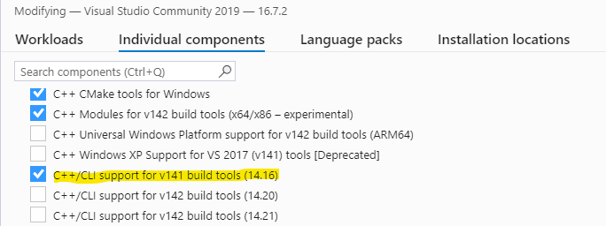
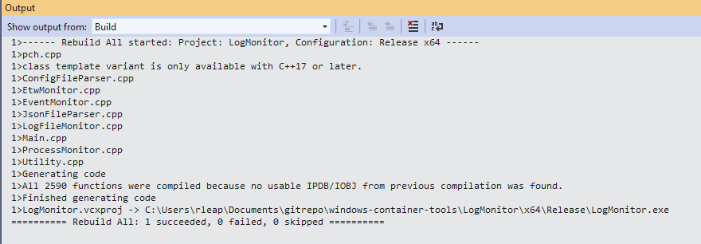

# Windows Container Log Monitor Tool

Microsoft provides some [troubleshooting guidance for Windows Containers](https://docs.microsoft.com/en-us/virtualization/windowscontainers/troubleshooting).  In that guidance there is reference to a ```LogMonitor.exe``` tool and a link to its [GitHub repo](https://github.com/microsoft/windows-container-tools/tree/master/LogMonitor).  I could not find the compiled executable for download so I compiled it myself (and stashed it here in the repo):

## Build
1. Downloaded and installed Visual Studio Community Edition (2019)
1. Chose '.NET desktop development' and 'Desktop development with C++' for Workloads (guesses)
1. Was not able to compile - turns out I needed build tools that came with VS 2017
1. Under 'Individual Components' --> [X] C++/CLI support for v141 build tools. 
1. At that point I was able to clone the LogMonitor GitHub repo
1. Open the project (LogMonitor.sln)
1. Changed Build --> Configuration Manager --> Active solution configuration --> Release
1. Build LogMonitor 

Alternatively, I was able to compile from the command line as follows:

```& 'C:\Program Files (x86)\Microsoft Visual Studio\2017\BuildTools\MSBuild\15.0\Bin\MSBuild.exe' .\LogMonitor.sln /p:platform=x64 /p:configuration=Release```

## Release Info
```
        C:\Tools\LogMonitor.exe /?

        LogMonitor Tool Version 1.1.0.0

        Usage: LogMonitor.exe [/?] | [--help] | [[/CONFIG <PATH>][COMMAND [PARAMETERS]]]

        /?|--help   Shows help information
        <PATH>      Specifies the path of the Json configuration file. This is
                    an optional parameter. If not specified, then default Json
                    configuration file path C:\LogMonitor\LogMonitorConfig.json is used
        COMMAND     Specifies the name of the executable to be run
        PARAMETERS  Specifies the parameters to be passed to the COMMAND

        This tool monitors Event log, ETW providers and log files and write the log entries
        to the console. The configuration of input log sources is specified in a Json file.
        file.
```
## Download

```Invoke-WebRequest -Uri https://github.com/rleap-m/windows-container-log-monitor/raw/master/bin/LogMonitor.exe -OutFile LogMonitor.exe```
